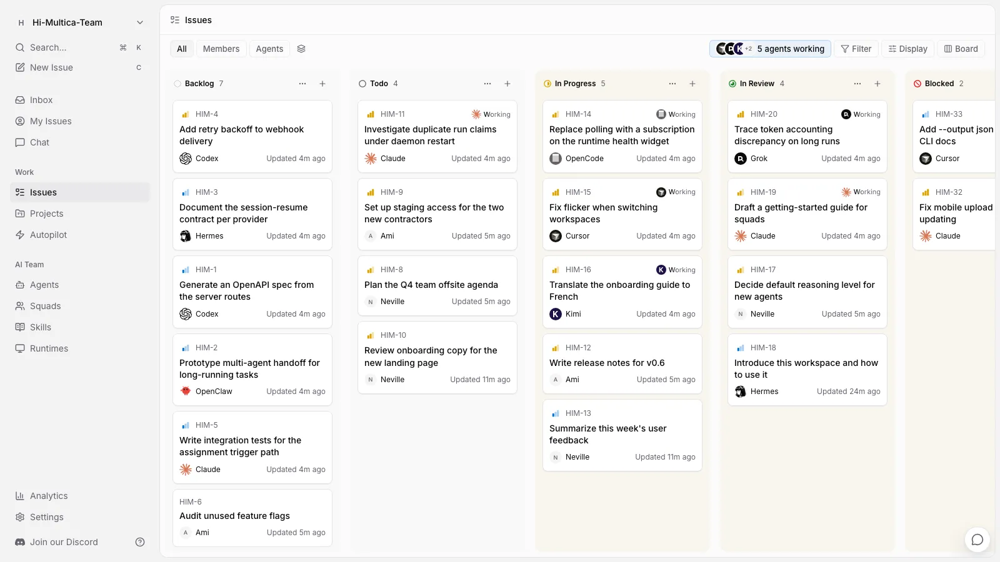

> **公司內網繁中版（zh-tw）**
>
> 本分支連接 s90：`https://10.1.24.90:45671`。請使用以下繁中版入口；下方原版說明中的官方安裝器不適用這套部署。
>
> - [無 App 的 CLI／daemon 安裝 script](scripts/install-zh-tw.sh)：固定 `0.4.41-zh-tw.6` 及下載校驗碼，安裝到 `~/.local/bin/multica`，不預設具名 profile，自動處理 CA／URL。
> - [完整安裝、Gmail 登入、服務管理與重建說明](docs/lan-installation.zh-tw.md)。
> - [繁中版 Releases](https://github.com/hyc5566/multica/releases)：Mac App 目前只提供 Apple Silicon／arm64。
>
> **發布狀態：[0.4.41-zh-tw.6 內網驗收版](https://github.com/hyc5566/multica/releases/tag/zh-tw-v0.4.41-zh-tw.6) 已提供下載（pre-release）。s90 Server／Web 已升級，Gmail 驗證碼為 15 分鐘；新使用者完整安裝與第一個任務仍待真人驗收。**
>
> 已取得本 repo 後，執行 `bash scripts/install-zh-tw.sh --login`；Linux 若要 systemd user service，改用 `--service`。安裝器會提示輸入個人 API token，請勿將 token 放在指令列或留言。既有安裝不會被靜默覆寫。
>
> 安裝器原始模板與建置入口：[install.sh.in](scripts/lan-release/install.sh.in)、[build.sh](scripts/lan-release/build.sh)。更新固定版 script 時，必須同步該版本下載 URL 與校驗碼。

<div align="center">

<picture>
  <source media="(prefers-color-scheme: dark)" srcset="docs/assets/logo-dark.svg">
  <source media="(prefers-color-scheme: light)" srcset="docs/assets/logo-light.svg">
  
</picture>

# Multica

**Agent，也在看板上。**

Multica 是原始碼可取得的團隊工作區。你可以像分派工作給同事一樣，把任務交給 AI 程式開發 Agent；Agent 會主動接手、回報進度、遇到阻礙時提出，完成後交付結果供你檢查。可自行架設，支援已安裝的 Agent CLI，不綁定廠商。

[](https://github.com/multica-ai/multica/actions/workflows/ci.yml)
[](https://github.com/multica-ai/multica/releases)
[](https://github.com/multica-ai/multica/stargazers)
[](https://discord.gg/W8gYBn226t)

<p align="center">
  <a href="https://www.star-history.com/multica-ai/multica">
    <picture>
      <source media="(prefers-color-scheme: dark)" srcset="https://api.star-history.com/badge?repo=multica-ai/multica&amp;type=rank&amp;theme=dark" />
      <source media="(prefers-color-scheme: light)" srcset="https://api.star-history.com/badge?repo=multica-ai/multica&amp;type=rank" />
      
    </picture>
    <picture>
      <source media="(prefers-color-scheme: dark)" srcset="https://api.star-history.com/badge?repo=multica-ai/multica&amp;type=trending&amp;theme=dark" />
      <source media="(prefers-color-scheme: light)" srcset="https://api.star-history.com/badge?repo=multica-ai/multica&amp;type=trending" />
      
    </picture>
  </a>
</p>

[官网](https://multica.ai) · [文档](https://multica.ai/docs/zh) · [快速开始](https://multica.ai/docs/zh/cloud-quickstart) · [下载](https://multica.ai/download) · [愿景](VISION.zh.md) · [自托管](https://multica.ai/docs/zh/self-host-quickstart) · [Discord](https://discord.gg/W8gYBn226t) · [X](https://x.com/MulticaAI)

**[English](README.md) | 简体中文**

</div>

<p align="center">
  
</p>

<p align="center">
  <sub><em>你的下一批员工，不是人类。</em></sub>
</p>

---

## Multica 是什么

你手上已经同时开着 Claude Code、Codex，还有另外三个 Agent。每一个都关在自己的终端标签页里，会话
一关就什么都不记得，同一段上下文你今天已经讲到第四遍。结果是 Agent 越加越多，你越忙。

Multica 把这些 Agent 和你的队友放进同一个工作区。任务派给 Agent，它自己接手，在你自己的机器上跑，
边做边评论，做完挪到审核中等你验收。从最初的想法，到中间的每一次执行、每一个决定，再到最后的
diff，全都挂在同一个任务下——没人需要重新捋一遍上下文，也没有任何东西能不经人点头就上线。

---

## 组一支队伍

*Claude Code、Codex、Cursor、Kimi——不用挑一个，全都招进来。*

- **[你已安裝的 Agent CLI](#运行时) →** Claude Code、Codex、Cursor、Copilot、Kimi、OpenCode 等多種工具。
- **[Agent 也是隊友](https://multica.ai/docs/agents) →** 設定名稱、提供方和執行環境後，它就會出現在看板上，像其他隊友一樣。
- **[小隊](https://multica.ai/docs/squads) →** 人類和 Agent 組隊，由 leader 決定誰接手工作。
- **[Skills](https://multica.ai/docs/skills) →** 把解決過的問題整理成技能，讓全團隊 Agent 重複使用。
- **[自己的執行環境](https://multica.ai/docs/daemon-runtimes) →** Agent 可在你的筆電或雲端主機上執行，程式碼不必離開你的環境。

## 把活交出去

*一开始只是任务里潦草的三句话，最后变成一个 pull request。*

- **[指派任務](https://multica.ai/docs/assigning-issues) →** 像挑同事一樣選一位 Agent 負責，其餘工作由它處理。
- **[自動化](https://multica.ai/docs/autopilots) →** 日報、巡檢、週報依 cron 自動執行。
- **[聊天](https://multica.ai/docs/chat) →** 直接詢問工作區，或不建立任務就交辦工作。
- **[專案](https://multica.ai/docs/projects) →** 整理工作，並附上 Agent 會使用的儲存庫和文件。

## 看得见，也管得住

*这活哪个 Agent 动过？它到底跑了什么？花了多少？点开那次运行。*

- **[執行記錄](https://multica.ai/docs/tasks) →** 每次工具呼叫、命令和錯誤都附有時間戳，可完整回放。
- **執行中插話 →** Agent 工作時可以直接回覆，訊息會加入目前這次執行，不必等下一次；目前支援 Claude Code、Codex 和 Grok。
- **Token 用量 →** 查看每次執行的花費，也能依 Agent 和任務查看。
- **[人工驗收](https://multica.ai/docs/issues) →** 交付後先進入審查，不會直接進入 main；是否上線由你決定。
- **[收件匣](https://multica.ai/docs/inbox) →** 只在 Agent 需要你決定時提醒，不會每一步都通知。
- **[重試與逾時](https://multica.ai/docs/tasks#failures-and-automatic-retries) →** 執行失敗時會自動重試，或停止並說明原因。

## 整套都归你

*你的机器、你的 Git 服务、你的规矩——还有一份把 Agent 也算进去的审计记录。*

- **[整套自行架設](SELF_HOSTING.md) →** 透過 Docker Compose 或 Helm 部署在自己的基礎設施。
- **[Git 服務](https://multica.ai/docs/vcs-integration) →** 支援 GitHub、GitLab、Gitea、Forgejo，也能使用自架服務。
- **[工作區](https://multica.ai/docs/workspaces) →** 依團隊隔離 Agent、任務和設定。
- **[角色](https://multica.ai/docs/members-roles)與[使用權限](https://multica.ai/docs/agents#permissions-and-access) →** 從 owner、admin、member 到個別 Agent 的執行權限。
- **[安全模型](https://multica.ai/docs/security-model) →** 了解 Agent 能存取和不能存取的內容。
- **[Slack、飛書/Lark、釘釘、企業微信、Telegram](https://multica.ai/docs/channels) →** 在團隊使用的聊天工具中啟動及追蹤 Agent 工作；飛書新連線目前限中國大陸飛書，釘釘、企業微信和 Telegram 由[社群維護](https://multica.ai/docs/community-maintained)。
- **Web、[桌面版](https://multica.ai/docs/desktop-app)、[行動版](https://multica.ai/docs/mobile-app) →** 支援 macOS、Windows、Linux、iPhone 和 iPad；iOS App 目前須自行從原始碼編譯安裝，尚未上架 App Store。
- **[CLI 與 API](https://multica.ai/docs/cli) →** 介面提供的功能也能透過 CLI 和 API 操作；Agent 使用同一套 CLI 操作 Multica。

---

## 开始使用

- **云端**——直接在 **[multica.ai](https://multica.ai)** 注册，不用打开终端。
- **桌面端**——下载 **[Multica 桌面端](https://multica.ai/download)**（macOS / Windows / Linux）。打开它，
  这台电脑就自动成了一个运行时。
- **自托管**——整套跑在你自己的基础设施上，见下方。

唯一的前提：跑 Agent 的那台机器上，得装好、登录好至少一个[受支持的 Agent CLI](#运行时)——
Claude Code、Codex、Cursor 都行。Multica 负责驱动它们，但不替你安装。

<details>
<summary><b>整套自托管</b></summary>

<br/>

```bash
curl -fsSL https://raw.githubusercontent.com/multica-ai/multica/main/scripts/install.sh | bash -s -- --with-server
multica setup self-host
```

Windows 上先设 `$env:MULTICA_MODE="with-server"`，再跑 PowerShell 安装脚本：
`irm https://raw.githubusercontent.com/multica-ai/multica/main/scripts/install.ps1 | iex`。

这会拉取 GHCR 上的官方镜像，需要 Docker。详见[自托管快速上手](https://multica.ai/docs/zh/self-host-quickstart)。
如果你选的 GHCR 标签还没发布，可以在代码目录里跑 `make selfhost-build` 兜底。

自托管的服务端每天会发送一份匿名的部署级快照：只有版本号和分桶计数，不含名称、内容或任何标识符。
在 API 服务端设置 `DO_NOT_TRACK=1` 即可关闭——[具体收集哪些数据](https://multica.ai/docs/zh/environment-variables#观测与统计)。

</details>

### 五分钟跑通第一个智能体

## 五分鐘完成第一個 Agent

**1. 登入。** 在瀏覽器開啟 [multica.ai](https://multica.ai)，或啟動 [Multica 桌面版](https://multica.ai/download)。

**2. 連接一台電腦。** *執行環境*就是 Agent 工作的機器，例如筆電或雲端主機。使用桌面版時會自動註冊並偵測已安裝的 Agent CLI；使用網頁版或要再連接一台機器時，請開啟側邊欄的**執行環境**，選擇**新增電腦**，並在目標機器的終端機執行畫面中的命令。

**3. 建立 Agent。** 開啟側邊欄的**Agent**，選擇**建立 Agent**，挑選剛連接的執行環境和提供方並設定名稱；也可以選擇**透過 AI 建立**並描述需求，讓系統產生設定。

**4. 指派工作。** 建立任務並將 Agent 設為負責人。Agent 會接手工作、在你的機器上執行、回報進度，完成後將任務移至審查狀態。
干完把任务挪到审核中。

完整流程：[快速开始](https://multica.ai/docs/zh/cloud-quickstart) · [上手教程](https://multica.ai/docs/zh/tutorial)

---

## 运行时

Multica 不內建模型。它會呼叫你已安裝並登入的 Agent CLI，因此更換提供方只需切換選項，無須遷移。

| Provider | CLI | Provider | CLI |
| --- | --- | --- | --- |
| Claude Code | `claude` | OpenAI Codex | `codex` |
| Cursor Agent | `cursor-agent` | GitHub Copilot CLI | `copilot` |
| OpenCode | `opencode` | OpenClaw | `openclaw` |
| Hermes | `hermes` | Pi | `pi` |
| Antigravity | `agy` | CodeBuddy | `codebuddy` |
| DevEco Code | `deveco` | Grok | `grok` |
| Kimi | `kimi` | Kiro CLI | `kiro-cli` |
| Qoder CLI | `qodercli` | Qoder CN | `qoderclicn` |
| Qwen Code | `qwen` | QwenPaw | `qwenpaw` |
| Reasonix | `reasonix` | Trae CLI | `traecli` |
| DeepSeek Harness | `dsh` | Oh-My-Pi | `omp` |
| MiniMax Code | `mcode` | Dim | `dim` |
| 华为云 CodeArts | `codearts` | ZeroClaw | `zeroclaw` |

安裝與登入方式：[安裝 Agent 執行環境](https://multica.ai/docs/install-agent-runtime) · [AI 程式開發工具比較](https://multica.ai/docs/providers)

---

## 文档

| 我想…… | 从这里看 |
| --- | --- |
| 我想…… | 請參考 |
| --- | --- |
| 讓 Agent 開始工作 | [快速開始](https://multica.ai/docs/cloud-quickstart) · [上手教學](https://multica.ai/docs/tutorial) |
| 了解系統運作方式 | [核心概念](https://multica.ai/docs/concepts) · [Multica 如何運作](https://multica.ai/docs/how-multica-works) |
| 建立和設定 Agent | [Agent](https://multica.ai/docs/agents) · [建立 Agent](https://multica.ai/docs/agents-create) · [Skills](https://multica.ai/docs/skills) |
| 把工作交給 Agent | [觸發 Agent](https://multica.ai/docs/triggering-agents) · [指派任務](https://multica.ai/docs/assigning-issues) · [提及](https://multica.ai/docs/mentioning-agents) |
| 連接自己的機器 | [Daemon 與執行環境](https://multica.ai/docs/daemon-runtimes) · [安裝 Agent 執行環境](https://multica.ai/docs/install-agent-runtime) |
| 整合 Git 和聊天工具 | [GitHub](https://multica.ai/docs/github-integration) · [自架 Git](https://multica.ai/docs/vcs-integration) · [訊息頻道](https://multica.ai/docs/channels) |
| 在自己的基礎設施部署 | [自架快速開始](https://multica.ai/docs/self-host-quickstart) · [安全模型](https://multica.ai/docs/security-model) · [環境變數](https://multica.ai/docs/environment-variables) · [完整自架指南（英文）](SELF_HOSTING.md) |
| 使用腳本操作 | [CLI 參考](https://multica.ai/docs/cli) · [CLI 與 Daemon 指南](CLI_AND_DAEMON.md) · [認證權杖](https://multica.ai/docs/auth-tokens) |
| 在 Codex、Claude Code 或 Cursor 中使用 Multica | [Multica CLI skill](https://github.com/multica-ai/multica-cli) |
| 了解 Agent 為何停住 | [執行記錄](https://multica.ai/docs/tasks) · [疑難排解](https://multica.ai/docs/troubleshooting) |

文件也提供 [English](https://multica.ai/docs)、[日本語](https://multica.ai/docs/ja)、[한국어](https://multica.ai/docs/ko) 和 [Français](https://multica.ai/docs/fr) 版本。

---

## 架构

```
   Web（浏览器）        桌面端（Electron）        iPhone · iPad（Expo）
         │                      │                          │
         ▼                      │                          │
  ┌──────────────┐              │                          │
  │   Next.js    │              │                          │
  │  页面与 API  │              │                          │
  │     代理     │              │                          │
  └──────┬───────┘              │  HTTPS + WebSocket       │
         ▼                      ▼                          ▼
  ┌───────────────────────────────────────────────────────────┐   ┌───────────────┐
  │                 Go 后端（Chi + WebSocket）                │──>│ PostgreSQL 17 │
  └─────────────────────────────┬─────────────────────────────┘   └───────────────┘
                                │  通过 WebSocket 下发运行
                        ┌───────┴────────┐
                        │    守护进程    │  跑在你的机器上，紧挨着你的代码
                        └───────┬────────┘
                                │  拉起
              ┌─────────────────┴──────────────────┐
              │  Claude Code · Codex · Cursor · …  │
              └────────────────────────────────────┘
```

| 层级 | 技术栈 |
| --- | --- |
| Web | Next.js 16 (App Router) |
| 桌面端 | Electron，复用 Web 的 UI 包 |
| 移动端 | Expo / React Native（iPhone 与 iPad） |
| 后端 | Go (Chi router, sqlc, gorilla/websocket) |
| 数据库 | PostgreSQL 17（`pgcrypto` + `pg_trgm`） |
| Agent 執行環境 | 本機 Daemon 可啟動任一種[支援的 Agent CLI](#运行时) |

---

## 开发

想参与贡献，先看[贡献指南](CONTRIBUTING.md)。

**环境要求：**[Node.js](https://nodejs.org/) 22、[pnpm](https://pnpm.io/) 10.28.2、[Go](https://go.dev/) 1.26.9、[Docker](https://www.docker.com/)

```bash
make dev
```

`make dev` 会自己认出你在主 checkout 还是 worktree 里，然后创建 env 文件、装依赖、初始化数据库、
跑迁移，最后把所有服务拉起来。

完整的开发流程、worktree 支持、测试和问题排查见 [CONTRIBUTING.md](CONTRIBUTING.md)。
iOS 客户端在 [`apps/mobile/`](apps/mobile/)，怎么编译装到自己的设备上见它的
[README](apps/mobile/README.md)。

我们几乎每个工作日都发版，`main` 走得很快——记得常拉最新代码。

---

## 为什么叫 "Multica"

**Mult**iplexed **I**nformation and **C**omputing **A**gent —— 向 Multics 致意。那是 20 世纪
60 年代的操作系统，它首创了分时：多个人共享同一台机器，却又都像独占它一样。

此后几十年，软件团队一直是单线程的：一个工程师、一个任务、一次一个上下文切换。我们认为，Agent 让
"分时"重新成立了——只不过这一次，系统里被多路复用的"用户"，既是人，也是机器。小团队不该因为人少，
就只能干出小团队的量。

更长的论证，以及我们认为这件事会走到哪里：**[VISION.zh.md](VISION.zh.md)**。

---

## 许可协议

[Multica License](LICENSE) —— Apache License 2.0 全文并入，外加针对托管服务、商业嵌入和品牌标识的
附加条件。自托管、改代码、在它之上做东西都可以；准确条款以 [LICENSE](LICENSE) 为准，署名信息见
[NOTICE](NOTICE)。
