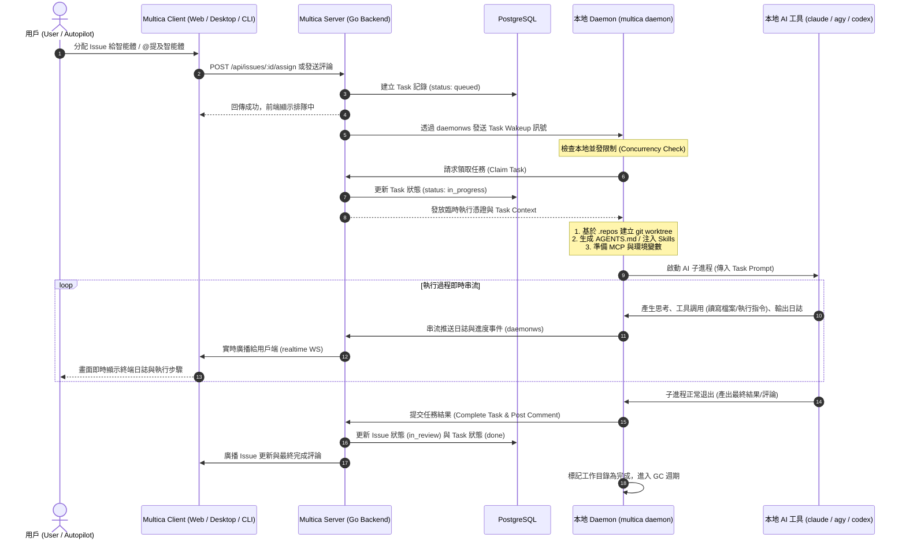

# Multica 系統架構與組件運作關係指南

本文件詳細闡述 Multica 的系統架構設計，以及 **Server（服務端）**、**Client（多端用戶端）**、**Daemon（本地守護進程）** 與 **Runtime（執行環境）** 之間的相互運作關係、通信協定與端到端任務執行流程。

---

## 1. 核心設計理念與架構概覽

Multica 採用**「雲端/服務端協同調度，本地環境安全執行」**的分離架構：
- **Multica Server**：作為中心樞紐，負責記錄協作數據（工作區、Issue、評論、任務狀態機）、權限認證、任務調度（Orchestration）以及即時狀態推播。
- **本地執行端（Daemon & Runtime）**：運行在用戶或開發者的實體/虛擬機器上，持有本機的程式碼目錄與 AI 程式工具（Agent CLIs）憑證，負責實際執行代碼讀寫、指令運行與工具調用。
- **多端用戶端（Client）**：包含 Web、Desktop、Mobile 及 CLI，為團隊提供 Issue 追蹤、智能體協同、即時日誌觀看與管理控制介面。

### 數據與安全邊界

| 層級 | 託管於 Multica Server | 保留在本地執行端（Daemon 機器） |
| :--- | :--- | :--- |
| **數據與狀態** | 工作區、Issue、評論、任務狀態、執行日誌串流、智能體配置 | 完整專案源代碼、Git 歷史、本地暫存檔 |
| **憑證與安全** | Multica 存取 Token (JWT/PAT)、工作區成員身份 | 第三方 AI 工具憑證（Claude / OpenAI / GitHub Copilot 等 API Key/登入態） |
| **運算與執行** | 任務分配決策、事件分發、外部整合（Slack/GitHub 等） | 編譯、測試、Shell 指令執行、檔案讀寫 |

> **核心安全性保證**：本機專案源代碼與 AI 模型憑證**永遠不需上傳**至 Multica 伺服器；伺服器僅傳遞任務上下文（Task Context）與接收執行產出的摘要/評論回報。

---

## 2. 系統核心組件詳解

```
+-------------------------------------------------------------------------------+
|                                 Multica Clients                               |
|   +------------------+  +-------------------+  +------------+  +----------+   |
|   |   Web Client     |  | Desktop App (GUI) |  | Mobile App |  |   CLI    |   |
|   |  (Next.js App)   |  |   (Electron)      |  |  (React N) |  | (Golang) |   |
|   +--------+---------+  +---------+---------+  +-----+------+  +----+-----+   |
+------------|----------------------|------------------|--------------|---------+
             | HTTP / REST          | HTTP / REST      | HTTP / REST  | HTTP/REST
             | Realtime WS          | Realtime WS      | Realtime WS  |
             v                      v                  v              v
+-------------------------------------------------------------------------------+
|                               Multica Server (Go)                             |
|  +-------------------------------------------------------------------------+  |
|  | HTTP Router & Handlers (Chi) + Middleware (Auth / Workspace Isolation)  |  |
|  +-------------------------------------------------------------------------+  |
|  | Services: IssueService / TaskService / RuntimeService / AuthService     |  |
|  +-------------------------------------+-----------------------------------+  |
|  | Realtime WebSocket (internal/realtime) | Daemon WebSocket (internal/daemonws)| |
|  +-------------------------------------+-----------------------------------+  |
|  | Storage: PostgreSQL (sqlc) | Redis (PubSub/Coordination) | S3/Local Blob  |  |
+----------------------------------------|--------------------------------------+
                                         | Daemon WebSocket (WS-RPC, Heartbeat,
                                         |                   Task Wakeup & Logs)
                                         v
+-------------------------------------------------------------------------------+
|                      Local Execution Machine (Daemon / Runtime)               |
|  +-------------------------------------------------------------------------+  |
|  | multica daemon (Daemon Process / Electron Background Daemon)            |  |
|  |  - Tool Discovery (掃描 PATH: claude, agy, codex, qwen, hermes...)      |  |
|  |  - Runtime Registration & 15s Heartbeat                                 |  |
|  |  - Task Claiming (WS Push Wakeup + 3s Periodic Polling)                 |  |
|  |  - Environment Isolation (Git Bare Cache `.repos` + `git worktree`)    |  |
|  |  - GC & Disk Management (Task Cleanup, Artifact TTL, Repo Maintenance) |  |
|  +-------------------------------------+-----------------------------------+  |
|                                        | Stdio / ACP Session Protocol         |
|                                        v                                      |
|  +-------------------------------------------------------------------------+  |
|  | Supported AI Coding CLIs (Claude Code / Antigravity / Codex / etc.)     |  |
|  |  - Local Worktree Workspace (`workdir/`)                                |  |
|  |  - Tool Credentials & LLM Access                                        |  |
|  |  - Skills & MCP Servers                                                 |  |
|  +-------------------------------------------------------------------------+  |
+-------------------------------------------------------------------------------+
```

---

### 2.1 Server（服務端）

服務端由 Go 語言編寫，主要職責包括：
1. **API 與認證中心**：
   - 提供 RESTful API（基於 Chi 路由），處理工作區、成員、Issue、評論、智能體（Agents）與專案資源的管理。
   - 提供基於 JWT 與個人存取憑證（PAT）的身份認證，支援工作區級別的多租戶數據隔離。
2. **雙 WebSocket 服務架構**：
   - **`internal/realtime`（用戶端 WebSocket）**：負責向 Web / Desktop / Mobile 用戶端廣播 Issue 狀態變化、新評論、收件匣通知及任務執行的即時串流輸出。
   - **`internal/daemonws`（守護進程 WebSocket）**：建立與本地 Daemon 的長連接，負責 Daemon 身份驗證、Runtime 在線狀態維護、心跳偵測（Ping/Pong）、任務喚醒通知（Task Wakeup）與雙向 RPC 調用。
3. **任務調度與協同（TaskService）**：
   - 當 Issue 分配給智能體或觸發自動化（Autopilot）時，生成 `queued` 狀態的任務。
   - 管理並發控制（智能體層級並發與 Daemon 機器層級並發）。
   - 維護任務狀態機（`queued` → `in_progress` → `in_review` / `done` / `failed` / `cancelled`）。
4. **外部整合**：
   - 監聽並處理 GitHub Webhooks、Slack、Lark（飛書）、DingTalk（釘釘）與 Telegram 事件。

---

### 2.2 Client（多端用戶端）

1. **Web Client (`apps/web`)**：
   - 基於 Next.js App Router 與 React，採用 `@tanstack/react-query` 處理服務端數據快取，`zustand` 管理用戶端狀態。
   - 透過 HTTP REST API 進行資料讀寫，透過 Realtime WebSocket 即時反映多人協同狀態。
2. **Desktop App (`apps/desktop`)**：
   - 基於 Electron 與 electron-vite，復用 `@multica/views` 共享 UI。
   - **特殊職責**：內建並託管本地的 `multica` CLI/Daemon 進程生命週期，為一般用戶提供「無需手動啟動終端命令列，開箱即用」的本地執行環境。
3. **Mobile App (`apps/mobile`)**：
   - 基於 Expo / React Native，提供行動端 Issue 追蹤、回覆與智能體進度審查。
4. **CLI (`multica`)**：
   - 供開發者與自動化腳本使用的命令列工具，支援 Issue 操作、工作區切換、配置調整，並可直接管理 Daemon 守護進程（`multica daemon start/stop/status/logs`）。

---

### 2.3 Daemon（本地守護進程）

Daemon 是常駐在本地電腦的後台進程（由 `multica daemon start` 啟動或由 Desktop App 自動拉起），是串聯 Multica 雲端與本地工具的關鍵核心：

1. **工具自動偵測（Tool Discovery）**：
   - 啟動時主動掃描系統 `PATH`，偵測已安裝的 AI CLI 工具（如 Claude Code, Antigravity CLI, OpenAI Codex, OpenCode, Hermes, Pi, Cursor Agent, Kimi, Qoder, Trae, Qwen Code 等）。
2. **Runtime 註冊與心跳保活**：
   - 將本機所有偵測到的工具與自定義 Runtime 配置註冊至伺服器對應工作區中。
   - 每 15 秒向伺服器發送心跳（Heartbeat），若超過約 3 分鐘無心跳，伺服器會將該 Runtime 標記為離線。
3. **任務領取（Task Claiming）**：
   - 透過 `daemonws` WebSocket 接收伺服器即時派發的任務通知（Wakeup）。
   - 保留定期輪詢（預設 3 秒）作為斷線與網路抖動時的補償機制，主動向伺服器領取指派給本機 Runtime 的任務。
4. **獨立工作目錄構建（Worktree Isolation）**：
   - 在 `MULTICA_WORKSPACES_ROOT` 下為每次執行建立獨立的目錄。
   - 透過本機 `.repos/` 裸倉庫緩存（Bare Git Clone）與 `git worktree` 技術，實現秒級建立輕量且完全隔離的代碼分支環境。
   - 注入執行上下文：自動生成 `AGENTS.md`、掛載 Skills 技能包、注入 MCP 設定與環境變數。
5. **進程生命週期與串流（Process Execution & Streaming）**：
   - 根據工具類型調用底層 Provider（如 Stdio 管道或 ACP 會話協定），啟動 AI CLI 執行。
   - 實時捕獲標準輸出、結構化事件及日誌，透過 WebSocket 即時串流回傳給 Server。
   - 監控看門狗機制（Watchdogs）與逾時限制，支援優雅中止（Graceful Cancel）。
6. **垃圾回收與磁碟管理（Garbage Collection, GC）**：
   - 定期掃描並清理已完成/已取消 Issue 的過期任務目錄（預設 TTL 24 小時）。
   - 清理可再生的巨大構建產物（如 `node_modules`, `.next`, `.turbo`）。
   - 維護 Git 裸倉庫與長效記憶庫（如 Hermes memory store）。

---

### 2.4 Runtime（執行環境概念）

在 Multica 中，**Runtime** 是一個核心的「邏輯執行環境」概念：
- **實體關係**：一個 Runtime 代表 **「一台特定的電腦（Daemon） + 該電腦上的一款 AI 工具（或自定義 Profile） + 關聯的工作區」**。
- **範例**：若用戶 Alice 的電腦上安裝了 `claude` 與 `agy`，且 Alice 加入了「前端團隊」與「後端團隊」兩個工作區，則 Alice 的 Daemon 會在伺服器上分別註冊 4 個 Runtime（2 台機器/工作區映射 × 2 款工具）。
- **私有與公開（Private vs Public）**：
  - **私有（預設）**：只有該電腦的擁有者可以在此 Runtime 上建立並運行智能體。
  - **公開**：擁有者可將 Runtime 開放給工作區其他成員，其他成員即可將智能體任務調度至該機器執行（但不會洩漏該機器的底層登入憑據）。
- **自定義 Runtime Profile**：
  - 支援企業內部封裝的 Wrapper 腳本或指定參數（如自定義模型端點、內部安全審計代理）。

---

## 3. 端到端協同運作流程

以下展示從用戶發起任務到 AI 智能體在本地完成執行的完整時序：



---

## 4. 通信協定與介面總結

| 交互路徑 | 傳輸協定 | 核心用途與傳輸內容 |
| :--- | :--- | :--- |
| **Client ➔ Server** | HTTP REST / JSON | Issue CRUD、工作區設定、成員權限、智能體配置管理。 |
| **Server ➔ Client** | WebSocket (`/ws`) | 實時事件（Issue 狀態變更、評論更新、Task 日誌串流推送）。 |
| **Daemon ➔ Server** | HTTP REST & WebSocket (`/daemon/ws`) | 身份驗證、Runtime 註冊、15s 心跳保持、任務領取、雙向 RPC。 |
| **Server ➔ Daemon** | WebSocket (`/daemon/ws`) | 任務喚醒（Task Wakeup）、任務取消指令（Task Cancellation）。 |
| **Daemon ➔ Server** | WebSocket 串流 / RPC | 執行日誌即時回傳（Stdout/Stderr）、Token 用量統計、結果回報。 |
| **Daemon ➔ Agent CLI** | 本地進程 Stdio / ACP 協定 | 子進程調用、命令列參數傳遞、ACP (Agent Communication Protocol) 會話管理。 |

---

## 5. 常見場景與異常處理機制

### 5.1 守護進程離線（Daemon Offline）
- **心跳中斷**：Daemon 每 15 秒發送心跳；若伺服器連續約 3 分鐘未收到心跳，會將該 Runtime 標記為離線。
- **排隊保護**：當 Runtime 離線時，新建立的任務會在隊列中等待（預設最多等待 2 小時，由 `MULTICA_TASK_QUEUED_TTL` 控制）。
- **重啟恢復**：Daemon 重新啟動並連線後，會重新註冊 Runtime，自動領取積壓的隊列任務，並清理上一次未正常結束的殘留狀態。

### 5.2 並發限制與調度（Concurrency Control）
- **雙層並發防護**：
  1. **智能體層級（Agent Level）**：每個智能體預設最多同時執行 6 個任務。
  2. **守護進程層級（Daemon Level）**：每台機器預設最多同時執行 20 個任務（可透過 `MULTICA_DAEMON_MAX_CONCURRENT_TASKS` 調整）。
- 當並發達到上限時，後續任務保持 `queued` 排隊狀態，待運行中任務結束後立即依序出隊。

### 5.3 任務逾時與看門狗（Watchdogs）
- 守護進程內建語意無活動看門狗（Semantic Inactivity Watchdog）：
  - 若 AI 工具進程無任何輸出或陷入死鎖（如 Codex 超過 10 分鐘無反應），Daemon 將自動終止進程並將任務標記為失敗/逾時，防止無效佔用機器資源。

### 5.4 磁碟與工作區生命週期（GC 策略）
- **任務目錄清除**：當 Issue 狀態變更為 `done` 或 `cancelled` 且閒置超過 24 小時（`MULTICA_GC_TTL`），Daemon 自動清除該任務目錄。
- **構建產物回收**：任務完成後超過 12 小時（`MULTICA_GC_ARTIFACT_TTL`），Daemon 會自動清理 `node_modules`、`.next` 等巨大暫存目錄以釋放磁碟空間，但保留源碼與 Git 狀態以便後續追溯。
